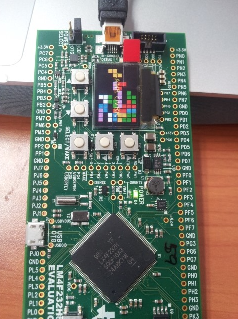
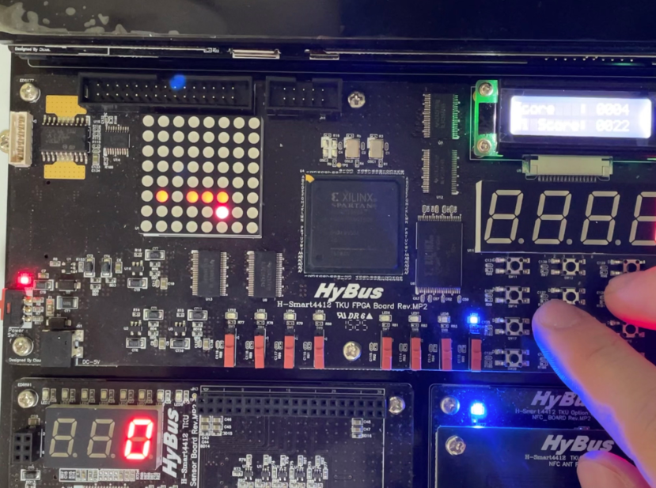
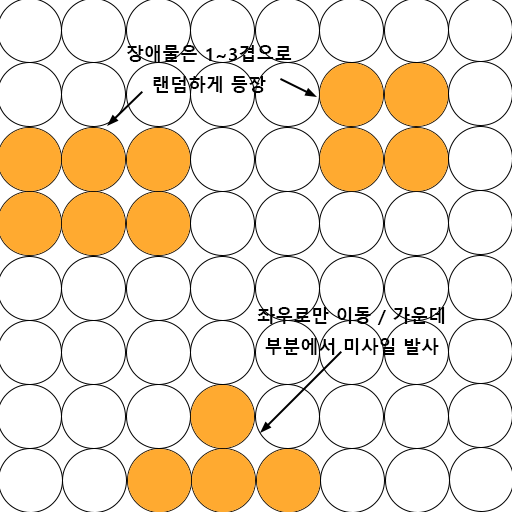

# 1차 발표

### 프로젝트 계획

## 주제선정

주제선정에 앞서 사전조사를 진행했다. 임베디드 시스템으로 진행된 프로젝트 대부분이 간단한 게임을 만드는 것이었다.

아래 사진 2개는 임베디드 시스템으로 테트리스 게임, 스네이크 게임을 구현한 사진이다.

또한 장치들의 특성상 복잡한 게임보다는 간단한 종류의 게임을 만드는 것이 좋다 생각해서 위 2개의 게임과 비슷한 고전게임인 __갤러그 게임__ 을 구현하기로 했다.

 

## 세부 구상

### 우주선

* 사용자가 직접 조작
* 좌우로만 이동 가능
* 미사일 발사로 장애물 파괴

### 장애물

* 위치 및 두께가 랜덤으로 등장
* 우주선이 발사한 미사일에 맞으면 파괴

### 게임 운영

* 우주선이 장애물에 부딪히면 게임 오버
* 장애물을 부술때마다 점수 증가
* 스테이지 별 시간이 존재
* 해당 시간동안 생존시 다음 스테이지로 넘어감

### 사용 장치

* Dot Matrix - 게임 화면 표시
* CLCD - 점수&스테이지 표시
* 7 Segment - 스테이지 남은 시간 표시
* Tact Switch - 이동&미사일 발사 조작

### Dot Matrix 화면 구상

 

## 차별점

앞서 사전조사한 테트리스 게임과 스네이크 게임을 포함해서 대부분 게임 프로젝트들은 
